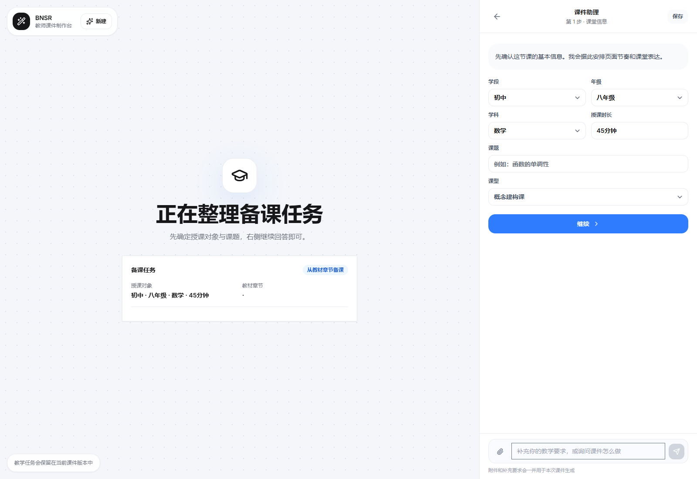

# Teacher AgentPPT

## 使用与部署文档

- [云端部署与更新手册](docs/DEPLOYMENT_MANUAL_20260718.md)
- [教师图文操作手册（15 张真实操作截图）](docs/TEACHER_USER_MANUAL_20260718.md)
- [管理员与 100 人内测操作手册](docs/ADMIN_OPERATIONS_MANUAL_20260718.md)
- [2026-07-18 发布说明](docs/RELEASE_NOTES_20260718.md)
- [100 人内测执行手册](docs/WAVE_100_PRIVATE_BETA_PLAYBOOK_20260718.md)
- [消防队 Agent 指令](agents/private-beta-fire-response-agent.md)

> 把教材、教案和旧课件，变成老师真正能改、能讲、能继续迭代的课堂 PPT。

[](https://nextjs.org/)
[](https://www.typescriptlang.org/)
[](#可编辑不是截图)
[](docs/STATUS.md)
[](THIRD_PARTY_NOTICES.md)

Teacher AgentPPT 是一个面向真实备课流程的 AI 课件助手。它不要求老师先学会复杂提示词，而是从老师熟悉的东西开始：**教材章节、教案材料、已有 PPT 和课堂要求**。

系统先策划“这节课怎么讲”，再生成“每一页放什么”，最后导出可继续编辑的 PPTX。老师可以修改、追问、补材料和回到历史版本，而不是只能接受一次性的 AI 成品。

> 当前阶段：核心产品链已进入内测准备；公开仓库用于工程协作和真实进度展示，尚未标记为商业正式版。

## 先看产品


### 两套样品的正式视觉

| 初二语文《背影》 | 高二物理《楞次定律》 |
| --- | --- |
|  |  |

[查看 8 张完整样品视觉](docs/assets/samples/README.md)

### 老师只需要选择从哪里开始

| 入口 | 老师提供什么 | 系统负责什么 |
|---|---|---|
| 从教材章节备课 | 学段、年级、学科、教材、章节、教学要求 | 设计课堂结构、逐页目标、例题、练习和总结 |
| 从教案生成 | Word、PDF、教材节选、练习资料或粘贴内容 | 解析材料、提取依据、组织成可讲授的课件 |
| 优化已有课件 | 原 PPTX 和希望保留/重做的范围 | 保留原稿，按保守、标准、深度三档重新组织 |



教材版本、出版社、年份、册次、页码和章节会进入策划；旧课件优化支持保守、标准和深度三档，且原文件不会被覆盖。

## 为什么老师会需要它

通用 PPT 生成工具通常从一句话扩写内容，但老师备课面对的是另一组问题：

- **不能脱离教材。** 同一个课题在不同学段、版本和章节中的教学重点不同。
- **不能千课一面。** 语文、数学、英语和物理不应共享同一套课堂动作。
- **不能生成后就锁死。** 老师需要临场调整、增删练习、替换例子和继续编辑。
- **不能把 AI 成功当成交付成功。** 页面还要检查溢出、层级、课堂可读性和版本来源。
- **不能让一次修改覆盖全部历史。** 教师需要知道改了什么，也要能够回到原稿。

Teacher AgentPPT 将这些问题拆成一条可追溯的产品链：

```text
教师任务
  -> 教材与材料绑定
  -> 课堂内容策划
  -> 教师确认大纲
  -> 逐页内容与版式
  -> 课前质量检查
  -> 可编辑 PPTX
  -> 教师调整与不可变版本
```

## 可编辑，不是截图

导出的课件以原生文本、形状、表格、图表和图片对象组成。浏览器预览与 PPTX 导出共同消费 `RenderScene`，避免“网页看起来正常，下载后完全变样”。

可查看 [PPTX 成品验收脚本](scripts/teacher-final-pptx-acceptance.mjs) 与 [浏览器/PPTX 渲染架构](docs/TEACHER_PPT_RENDERING_ARCHITECTURE_20260716.md)，复核原生对象、占位字段、乱码和页面完整性检查。

当前已验证 9 页课件可由 PowerPoint 真实打开并渲染，未发现乱码、禁用占位字段或空白页。该样例用于证明导出和渲染链，不代表所有学科内容已经完成商业验收。

## 图片模型能做什么

图片不是装饰品，而是课堂观察、操作和情境证据。系统为每页生成学科与页面角色相关的视觉提示词，并将远程图片、原生可编辑视觉和失败状态分开记录。

真实图片链证据可查看 [应用端验收脚本](scripts/image2-app-real-acceptance.mjs)、[供应商回归脚本](scripts/image-provider-regression.mjs) 和 [当前状态卡](docs/STATUS.md)。`gpt-image-2` 的 3 路并发验收曾达到 3/3 成功；但分钟级图片任务、额度控制和完整课件断点恢复仍在稳定化，因此项目不会把“接口出过图”包装成“图片生产链已经完成”。

## 当前能力

- 三条教师主线：教材章节、教案材料、优化已有 PPT。
- 教材身份字段：出版社、版次年份、册次、页码、单元、章节。
- 动态课程策划：页数和页面角色由课时与教学任务决定，不固定为九页。
- 13 类教师版式协议：导入、目标、概念、例题、练习、互动、纠错和总结等。
- 不可覆盖版本链：教师和 AI 的修改创建新版本，旧版本保持不变。
- 课前评分 V3：教材对齐、教学设计、学科正确、视觉表达、工程质量和教师效率。
- 统一视觉编译：浏览器和 PPTX 共享场景模型。
- 原生 PPTX：核心内容可以在 PowerPoint 中继续修改。
- 视觉 QA：检查文本溢出、重叠、图片占位、页面密度和可编辑性。
- 真实来源边界：教师上传材料、正式搜索结果和实验性搜索来源明确分级。

## 已验证到什么程度

| 范围 | 当前证据 | 结论 |
|---|---|---|
| 三条入口与响应式界面 | 桌面 1600px、移动 390px，无请求失败 | 已验证 |
| 教材章节字段 | 教材、出版社、年份、册次、页码、单元、章节 | 已验证 |
| 无 AI 图片的真实教师流程 | 9 页生成、版本保存、PPTX 导出约 1 分 47 秒 | 已验证 |
| PowerPoint 成品 | 9/9 页真实渲染，无乱码和占位字段 | 已验证 |
| 学科差异 | 数学、语文、英语角色/标题/内容指纹不同 | 已验证到 3 学科 |
| 物理、化学等深学科策划 | 通用理科结构存在，真实教材矩阵不足 | 待验证 |
| 图片供应商 | `gpt-image-2`、SSE、3 路并发曾 3/3 成功 | 局部验证 |
| 带图片完整课件 | 曾出现长耗时、重试、额度消耗和流程超时 | 未稳定 |
| 云端内测部署 | 当前仍为 SQLite + 本地文件 | 未开始 |

完整事实边界见 [当前状态](docs/STATUS.md) 和 [内测准备路线图](docs/PRIVATE_BETA_ROADMAP_20260716.md)。

## 快速开始

要求：Node.js 20+、npm。

```bash
git clone https://github.com/liaoj0330-bot/teacher-agentPPT.git
cd teacher-agentPPT
npm install
cp .env.example .env.local
npm run dev
```

浏览器打开：

```text
http://127.0.0.1:3002/teacher-ai-ppt
```

Windows PowerShell 可以使用：

```powershell
Copy-Item .env.example .env.local
npm run dev
```

模型、图片和搜索供应商都通过 `.env.local` 配置。不要把任何真实密钥提交到 Git。

## 最小配置

```dotenv
DATABASE_URL=file:./dev.db
OPENAI_API_KEY=
OPENAI_BASE_URL=https://api.openai.com
OPENAI_MODEL=gpt-5.5

OPENAI_IMAGE_API_KEY=
OPENAI_IMAGE_BASE_URL=https://api.xcode.hk
OPENAI_IMAGE_MODEL=gpt-image-2
BETA_IMAGE_GENERATION_ENABLED=true
```

未配置图片模型时，系统允许使用原生可编辑视觉完成结构验收；不会用本地 SVG 冒充远程图片成功。

## 架构

```text
Teacher Brief
  -> ContentPlan / Teacher Context
  -> TeacherDeckPlan state machine
  -> DeckSpec + DesignSlide[]
  -> immutable CoursewareVersion
  -> RenderScene[]
  -> Browser renderer / PPTX renderer
  -> Visual QA + CoursewareArtifact
```

核心原则：

1. 先策划每页要解决的教学问题，再生成页面。
2. 用户或 AI 修改创建新版本，旧版本保持不变。
3. 导出只读取服务器冻结版本，不信任浏览器临时副本。
4. 浏览器与 PPTX 使用同一视觉场景模型。
5. 视觉 QA 失败时阻断交付，不把失败产物标记为完成。
6. 远程图片成功、原生降级和失败必须显式区分。

详细设计见 [架构说明](docs/ARCHITECTURE.md) 和 [渲染架构](docs/TEACHER_PPT_RENDERING_ARCHITECTURE_20260716.md)。

## 验证

```bash
npm run lint
npm run build
npm run teacher-product-v3:acceptance
npm run teacher-scoring-v3:test
npm run teacher-visual-contract:test
npm run teacher-render-scene:test
npm run teacher-visual-qa-v2:test
npm run teacher-visual-delivery:test
npm run teacher-page-gate:test
npm run teacher-layout-protocol:test
npm run teacher-template-layout:test
npm run source-asset:e2e
```

涉及真实模型的验收会产生费用。请先设置调用上限、测试页数和预算，不要直接重复运行整套图片流程。

## 下一步

当前顺序不是继续堆功能，而是把内测需要的稳定性做扎实：

1. 用真实教材完成数学、语文、英语、物理、化学、生物、历史和地理策划矩阵。
2. 验证教师连续修改、版本回退、补充材料和局部重生成的响应时间。
3. 将长时间图片生成改为可恢复的页面级任务，并加入预算上限。
4. 为邀请制内测准备单服务器持久化部署、HTTPS、备份、日志和故障恢复。
5. 由真实教师完成封闭体验，记录“是否省时间、是否能直接讲、修改是否顺手”。

## 参与项目

这个仓库适合以下人群：

- 想把 AI 真正用进备课，而不是只生成漂亮样例的教师。
- 关注可编辑 PPTX、版本追踪和课堂可用性的教育产品团队。
- 想研究“教材 -> 教学策划 -> 页面 -> PowerPoint”完整链路的开发者。

可以通过 Issue 提交学科案例、教材适配问题、课件截图和可复现 Bug。请勿上传真实密钥、学生信息或未经授权的教材全文。

觉得这个方向有价值，可以 Star 仓库并关注内测进展。真正有帮助的不是一句“很好用”，而是一条具体反馈：**哪位老师、哪门课、哪一步卡住、最后是否愿意继续用。**

## 项目资料

- [当前状态与风险](docs/STATUS.md)
- [真实客户链路、100 场景推演与 12 小时收口方案](docs/PRIVATE_BETA_DELIVERABILITY_AUDIT_20260717.md)
- [内测准备路线图](docs/PRIVATE_BETA_ROADMAP_20260716.md)
- [架构说明](docs/ARCHITECTURE.md)
- [安全与数据合规](SECURITY.md)
- [连续推进与会话恢复合同](docs/CONTINUITY_AND_RESUME_PROTOCOL.md)
- [失败防复发手册](docs/FAILURE_PLAYBOOK.md)
- [自媒体复盘素材库](docs/SELF_MEDIA_REVIEW_BANK.md)
- [卡点复盘与续跑协议](docs/obsidian/TEACHER_AGENTPPT_卡点复盘与续跑协议_20260715.md)
- [第三方声明](THIRD_PARTY_NOTICES.md)

## 安全与仓库边界

仓库不会提交真实密钥、教师私人材料、学生信息、SQLite 数据库、浏览器会话、运行日志或临时验收目录。公开截图和 AI 图片均为专门的测试内容。
