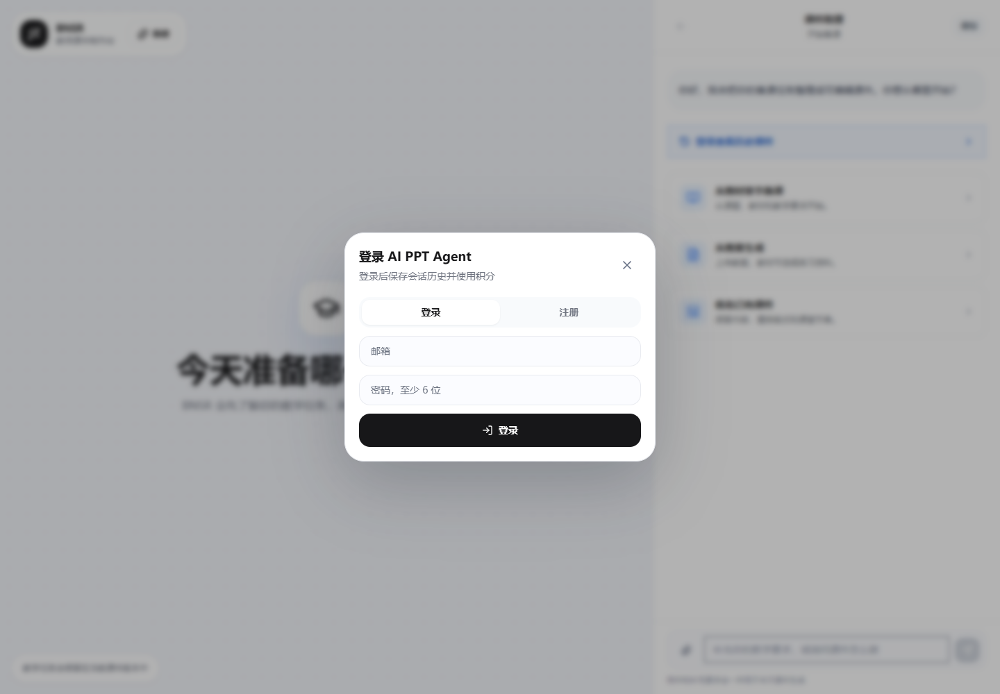
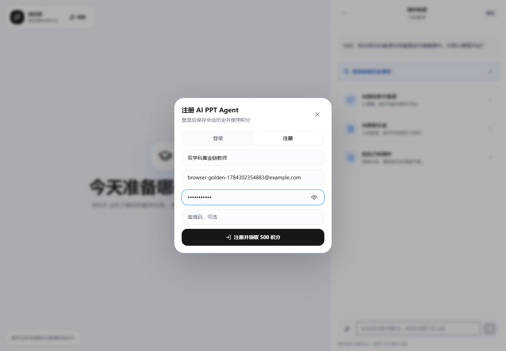
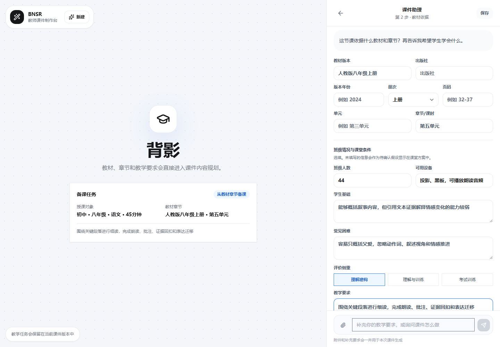
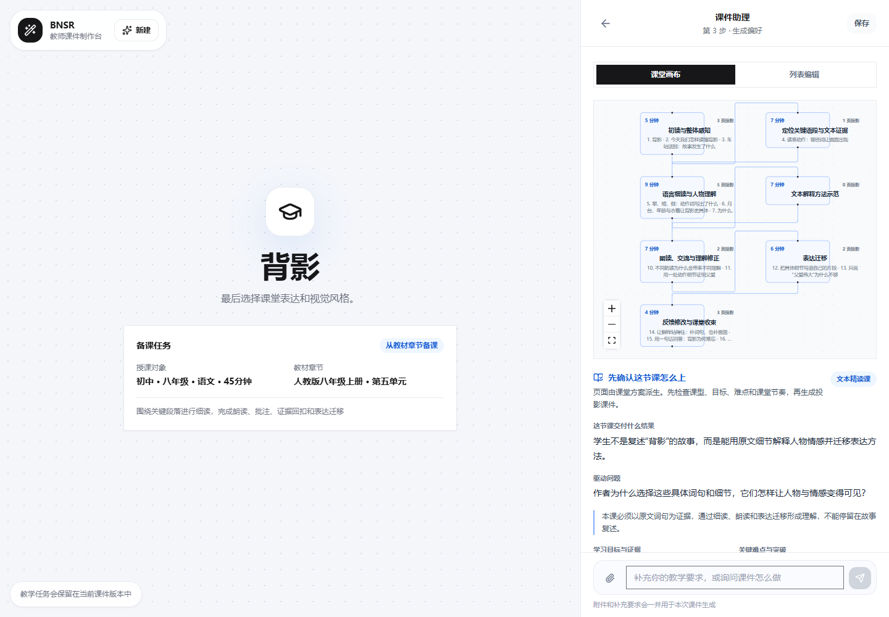
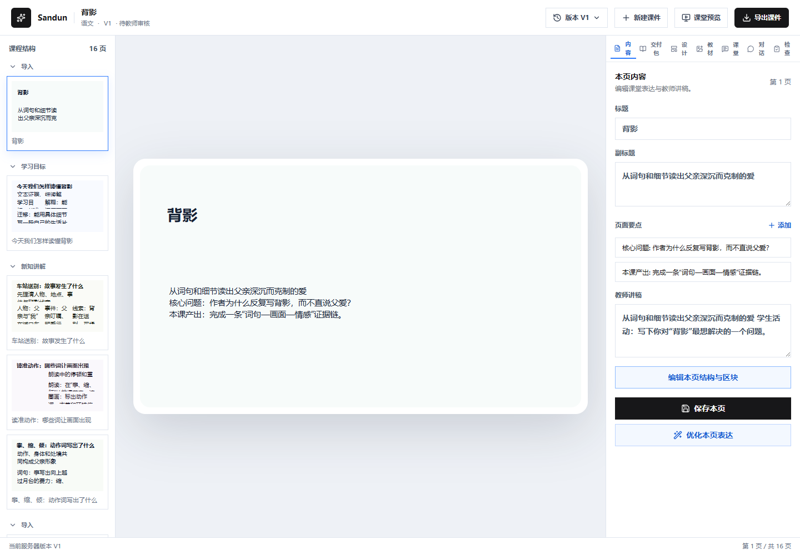
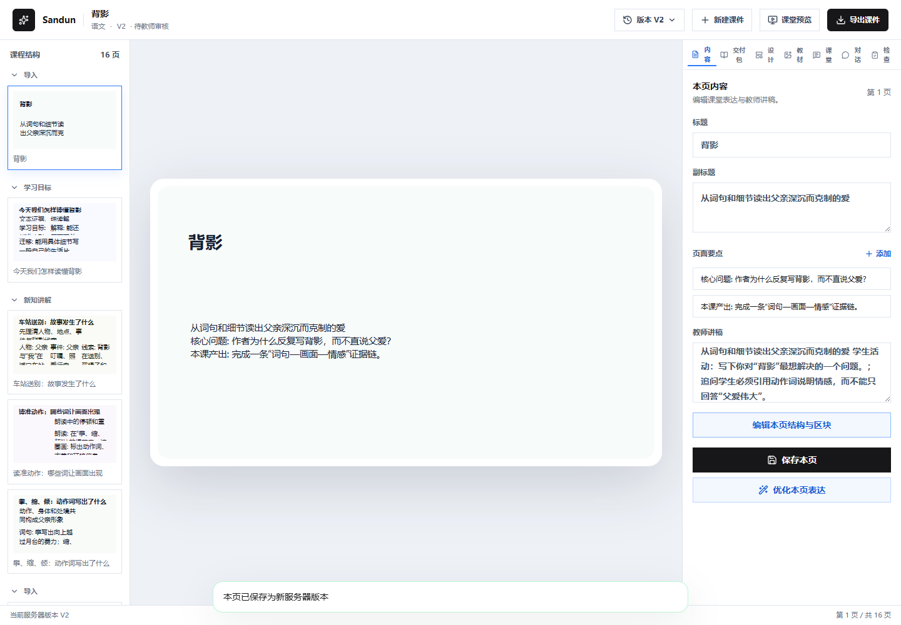
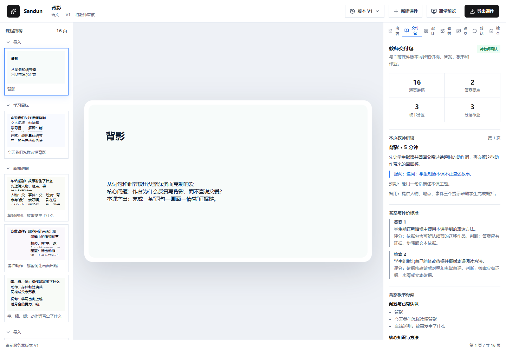
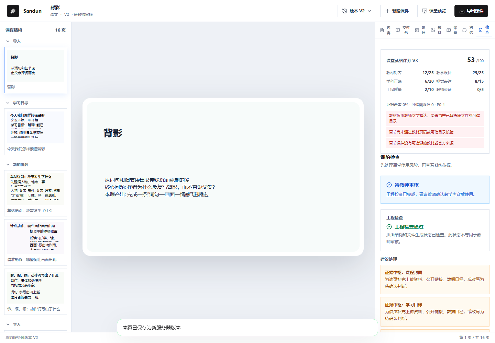
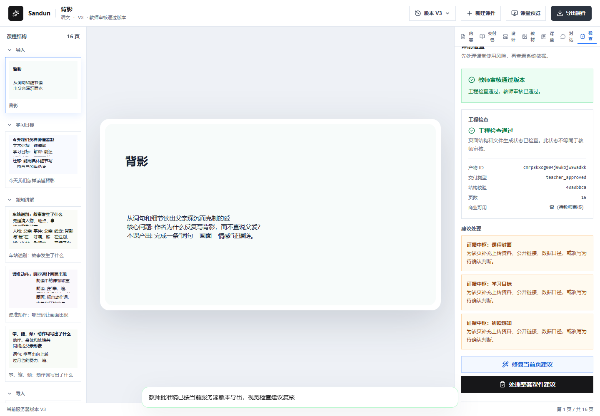
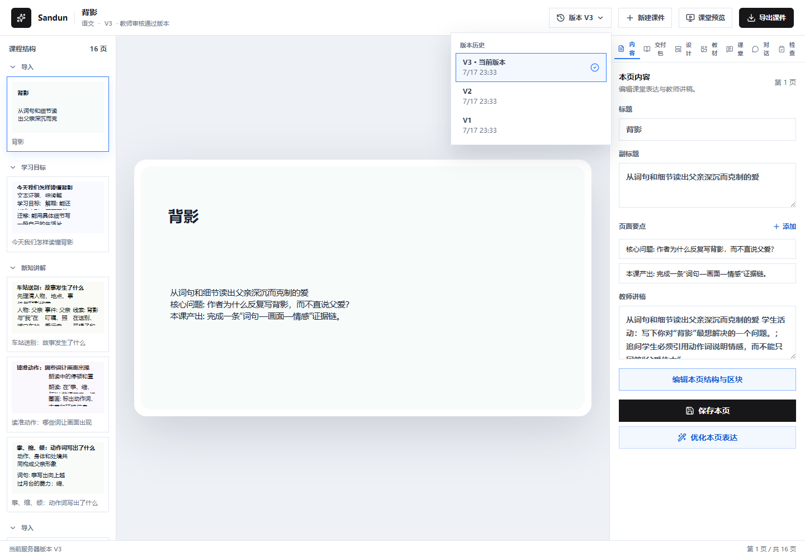

# Teacher AgentPPT 教师图文操作手册

> 适用范围：100 人内测版网页端
>
> 截图示例：初二语文《背影》，其他年级和学科的操作位置相同
>
> 建议设备：电脑端 Chrome 或 Edge，屏幕宽度 1280 像素以上

## 1. 开始前准备

开始备课前，请准备：

- 内测网址、内测邀请码、常用邮箱和至少 6 位密码。
- 准确的学段、年级、学科、课题、教材版本、册次和章节。
- 本班学生基础、常见困难、班级人数和教室设备。
- 如需上传教案、教材节选或旧 PPT，请提前删除学生姓名、手机号、成绩和未授权人脸。

一节课的标准流程是：

`登录 -> 新建课件 -> 填写课堂信息 -> 核对教材与学情 -> 设置生成偏好 -> 审核课堂方案 -> 生成课件 -> 修改并检查 -> 教师确认 -> 导出 PPTX`

## 2. 进入工作台并选择备课入口

打开内测网址后，右侧会显示三个入口。

### 三个入口怎么选

| 入口 | 适合情况 | 老师需要准备 |
| --- | --- | --- |
| 从教材章节备课 | 已确定教材、年级和章节 | 课题、教材版本、册次、单元或章节 |
| 从教案生成 | 已有 Word、PDF、教材节选、练习或文字教案 | 有权使用且已去除隐私的材料 |
| 优化已有课件 | 已有 PPT，希望重排、补齐课堂环节或改善视觉 | 可正常打开的 PPTX 文件 |

第一次使用建议选择“从教材章节备课”，最容易核对系统理解是否准确。

## 3. 注册和登录

### 3.1 已有账号直接登录

点击页面上的“登录查看历史课件”或“登录后生成课件”，输入注册邮箱和密码。

登录后可以保存课件、查看历史版本、使用积分并再次下载已经导出的课件。

### 3.2 第一次使用先注册

切换到“注册”，依次填写昵称、常用邮箱、密码和运营人员发放的内测邀请码，然后点击“注册并领取 500 积分”。

注意：

- 邀请码只供本人使用，不要发到公开群或截图传播。
- 建议使用长期可用的邮箱，课件历史与该账号绑定。
- 忘记密码、更换邮箱或邀请码失效时，联系内测运营人员。

## 4. 新建一节课

点击左上角“新建”，选择“从教材章节备课”。右侧会依次出现 3 个步骤。

### 4.1 第 1 步：填写课堂基本信息

依次选择学段、年级、学科，填写授课时长和课题，再选择课型。

填写要求：

- “课题”写本节真实课题，不要只写“第五单元”或“复习课”。
- “授课时长”按真实课堂填写，常规课可填 40、45 或 50 分钟。
- “课型”会影响课堂节奏。概念课、实验探究课、文本精读课和复习课的生成结构不同。
- 左侧“备课任务”卡片会同步显示当前识别结果；发现年级或学科不对，应先改正再继续。

填写完成后点击“继续”。

### 4.2 第 2 步：核对教材、学情和课堂条件

填写教材版本、出版社、版本年份、册次、单元、章节或课时。随后补充班级人数、可用设备、学生基础、常见困难、评价侧重和教学要求。

这一步直接决定课件是否适合真实课堂。建议至少认真填写以下四项：

1. 学生已经学过什么。
2. 学生最容易错在哪里。
3. 课堂可用哪些设备或材料。
4. 本节课希望学生最终完成什么任务。

教材匹配只用于辅助判断。如果出现“生成前需要复核”，请对照手中的纸质教材或学校目录确认。系统不能把目录匹配当成教材正文、页码或标准答案证据。

### 4.3 第 3 步：选择生成偏好

选择课堂表达方式、视觉风格和其他生成偏好。确认左侧任务卡片中的授课对象和教材章节都正确后，再点击“开始生成课件”。

生成偏好只影响表达和视觉，不会替代教材、学情和教学目标。不要为了“好看”选择与学科不匹配的风格。

## 5. 先审核课堂方案，再生成 PPT

系统首先生成的是课堂方案，不是最终 PPT。老师应先看课堂节奏，再决定是否生成。

### 5.1 用“课堂画布”看整节课节奏

课堂画布会显示每个环节的预计时间、教学任务和对应页面。

重点检查：

- 所有环节总时长是否接近真实课时。
- 是否包含导入、讲解或探究、学生任务、反馈、总结与迁移。
- 学生活动是否有明确产出，而不是只有“讨论一下”。
- 难点是否分配了足够时间。
- 课堂环节数量和 PPT 页数是否合理。页数由任务决定，不固定为 8 或 9 页。

### 5.2 用“列表编辑”修改教师动作

切换到“列表编辑”，可直接修改教师动作、学生动作、提问、预期回答和备用处理。

发现下列问题时，应先修改方案：

- 导入太长，挤占核心教学时间。
- 连续多页都是教师讲解，没有学生任务。
- 问题过大，学生不知道如何作答。
- 练习没有答案、评价标准或反馈动作。
- 教材章节、班级基础或课堂设备与实际不符。

确认无误后点击“确认课堂方案并生成”。生成期间不要连续重复点击，也不要关闭页面。

## 6. 在课件工作台逐页修改

生成成功后进入课件工作台。左侧是课件结构和页面缩略图，中间是当前页面，右侧是编辑工具。

### 6.1 常用区域

- 左侧“课程结构”：切换章节和页面。
- 中间画布：预览当前页的真实排版。
- 右侧“内容”：修改标题、副标题、页面要点和教师讲稿。
- 右侧“交付包”：查看逐页讲稿、答案、板书和分层作业。
- 右侧“设计”：调整页面版式，按需生成页面视觉。
- 右侧“教材”：核对材料和证据来源。
- 右侧“课堂”：核对课堂动作与页面的对应关系。
- 右侧“检查”：处理课前风险并提交教师审核。

### 6.2 修改内容并保存新版本

选择一页，在“内容”中修改标题、要点或教师讲稿，点击“保存本页”。系统会形成新版本，不覆盖旧版本。

“优化本页表达”适合压缩文字和改善投影表达，但使用后仍要检查事实、答案和学科术语。不要用它替代教师审核。

## 7. 检查教师交付包

点击“交付包”，检查与当前课件版本同步的四类内容：逐页讲稿、答案要点、板书分区和分层作业。

至少确认：

- 每个核心页面都有教师怎么讲、怎么问的提示。
- 课堂练习有答案和评价标准。
- 板书与课件结构一致，不是另一套内容。
- 作业包含基础、提高和迁移层次，并适合本班学生。
- 备用处理可以在学生答不出或时间不足时使用。

交付包不完整时，不建议直接导出上课。应返回相应页面或课堂方案补齐。

## 8. 图片和页面视觉怎么使用

图片功能默认由老师主动触发，不会因为生成文字课件而自动重复生图。

- 适合生成：情境、实验观察、实物关系、人物场景和操作步骤。
- 不适合生成：公式、长文字、表格、标准答案和精确数据图。
- 一页失败只重试该页，不要重新生成整套课件。
- 图片供应商维护时，可以继续使用无图课件并导出 PPTX。
- 图片中的文字、数字、公式和科学细节必须人工复核。

重要公式、答案和板书应保留为 PPT 原生文本，不能只放在图片里。

## 9. 课前检查与教师确认

点击右侧“检查”，先处理红色或橙色建议，再点击“提交教师审核”。工程检查通过不等于内容自动正确，教师仍需对知识、答案和教材依据负责。

提交前逐项确认：

- 教材、学科、年级、课题和课时正确。
- 例题、练习、答案、实验步骤和引用正确。
- 中文、英文、公式和标点没有乱码。
- 文本没有溢出、遮挡或过小。
- 图片没有缺失、变形或与内容无关。
- 整节课的活动时长接近真实授课时间。
- 学生任务、反馈和作业可以在本班落地。

## 10. 导出 PPTX

教师审核通过后，点击右上角“导出课件”。浏览器会下载当前教师确认版本的 PPTX。

下载后必须在最终授课电脑上用 WPS 或 PowerPoint 打开一次，并检查：

1. 文件能正常打开，没有修复提示。
2. 页面数量与网页工作台一致。
3. 字体、公式、图片和动画符合预期。
4. 页面对象仍可编辑。
5. 教室电脑、投影比例和音视频可以正常使用。

同一个已冻结版本重复下载不重复扣导出积分。

## 11. 找回课件和查看历史版本

登录后，首页“最近课件”区域会显示已经保存的项目。点击课题即可重新打开。

在工作台顶部点击“版本 Vx”，可以查看版本历史。历史版本是只读的；需要继续修改时，应恢复为新版本或返回当前版本。

版本功能适合比较：原始生成稿、教师修改稿、教师审核稿和最终导出稿。

## 12. 积分说明

| 操作 | 积分 |
| --- | ---: |
| 生成一套课件 | 24 |
| 首次导出 PPTX | 8 |
| 成功生成一张图片 | 6 |
| AI 精修一页 | 4 |

失败任务原则上不扣对应积分。若余额异常，请记录发生时间、课题、版本或任务 ID，并提交反馈。

## 13. 常见问题处理

### 页面一直显示生成中

不要连续点击。等待页面状态更新；超过页面提示时间后，提交反馈并附发生时间、课题和任务 ID。

### 提示 `Unexpected end of JSON input`

说明请求没有收到完整响应。先保留错误截图，不要重复整套生成；刷新后检查项目是否已保存，再提交反馈 ID，由值班人员检查服务日志。

### 图片失败但文字课件正常

继续检查和导出无图版本，或只重试失败页。图片故障不应阻止文字课件导出。

### 教材没有立即匹配

核对出版社、教材版本、册次和章节写法；有材料时上传对应章节。系统不确定时应由老师确认，不能自动猜测后直接生成。

### PPT 打开后字体变化或乱码

在最终授课电脑打开检查，优先使用常见中文字体。必要时在 PowerPoint 或 WPS 中替换字体并保存本地副本；同时提交出现问题的系统、软件版本和页面截图。

### 修改是否会覆盖旧课件

不会。教师修改和 AI 修改会生成新版本，旧版本会保留。

### 积分不足

先进入账户中心确认余额。内测期间需要补额时，向运营人员提供注册邮箱，不要提供密码。

## 14. 提交反馈和紧急问题

遇到问题时，打开工作台“内测”入口提交反馈，并提供：发生时间、学科、年级、教材、课题、项目或版本 ID、出问题的页码、完整错误提示和不含隐私的截图。

以下情况应立即联系内测支持人员：

- PPTX 损坏或无法打开。
- 多位老师同时出现教材错配或答案错误。
- 积分异常批量扣除。
- 账号、材料或密钥疑似泄露。
- 登录、生成或导出主链路大面积不可用。

## 15. 隐私和材料要求

不要上传学生身份证、手机号、家庭住址、个人成绩明细、未授权人脸、账号密码、API Key 或无权使用的教材扫描件。提交错误截图时，应先遮盖账号、学生信息和敏感材料。
