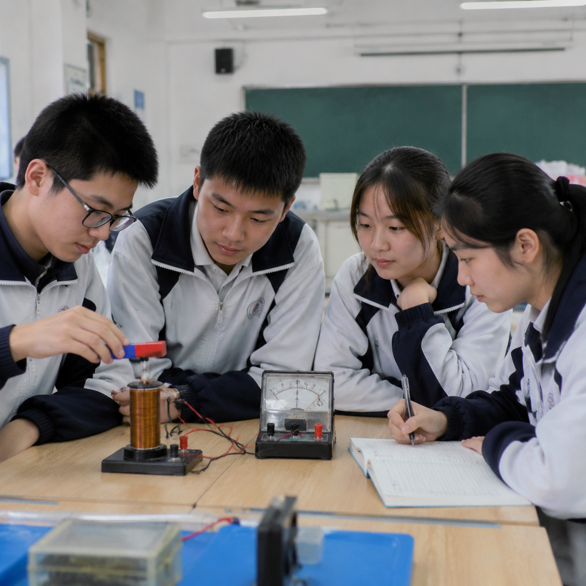

# Teacher AgentPPT 样品视觉图集

这里保存的是两套 45 分钟样品课件使用的正式视觉素材。它们从本地运行产物中筛选后单独纳入 Git，便于查看产品效果；日志、数据库、上传材料和批量测试截图仍然不进入仓库。

这些图片只承担课堂情境、观察和迁移任务，不承载公式、答案或长文字。实际课件中的标题、公式、问题和答案由可编辑的 PPT 原生对象完成。

## 初二语文《背影》

| 火车站主视觉 | 橘子细节 |
| --- | --- |
|  |  |

| 父亲翻越月台 | 生活迁移 |
| --- | --- |
|  |  |

## 高二物理《楞次定律》

| 实验器材特写 | 实验室主视觉 |
| --- | --- |
|  |  |

| 学生探究 | 制动迁移情境 |
| --- | --- |
|  |  |

## 边界说明

- 这些是样品资产，不是所有老师生成图片的公共素材库。
- 线上老师生成的图片必须保存在部署服务器的持久化存储中，不能依赖 GitHub。
- GitHub Pages 不能运行图片生成 API；仍需部署完整的 Next.js 服务端。
- 图片模型输出需要教师复核科学细节、时代细节和人物表达。
