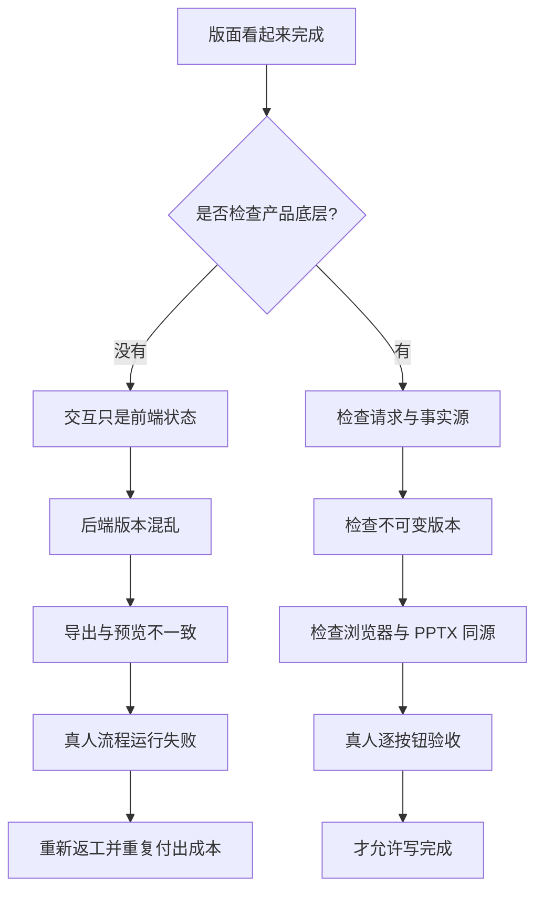
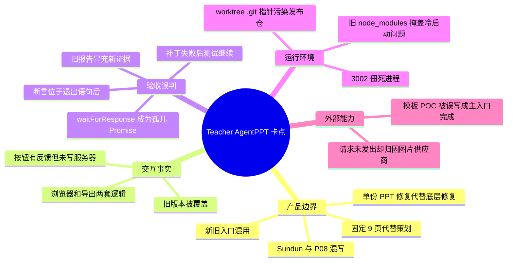
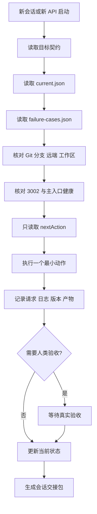
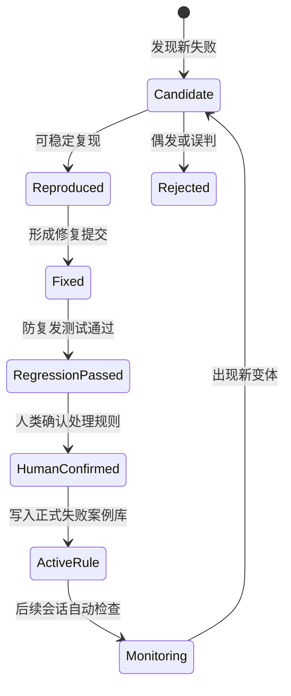
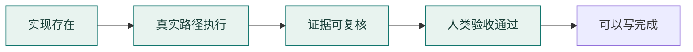

# Teacher AgentPPT｜卡点复盘与续跑协议

> [!important] 这页解决什么
> 进度只能告诉我们“走到哪里”；卡点复盘和续跑协议要保证“为什么停、下次怎么识别、修到什么程度、人类如何验收”。以后关闭会话、换模型或重新接入 API，先读这页，不再从零开始。

## 01 / 当前是否还能继续

可以继续，而且已经具备明确的事实基础：

- 公开仓库与合规发布链已经建立；
- 版本事实链、统一视觉编译和可编辑 PPTX 主干已有证据；
- 当前卡点已定位到真人按钮全流程、真实图片同源和模板主入口；
- 下一步不是重新设计版面，而是从第一个失败动作继续验证和修复。

但当前仍是 `PARTIAL / VERIFICATION`，不能写成完整产品或商业交付完成。

## 02 / 为什么过去代价很大

最核心的教训：**版面确定、接口通过、测试全绿、PPTX 能下载，任何单项都不能独立证明产品完成。**

## 03 / 主要卡点地图

## 04 / 下次遇到同样问题怎么处理

| 问题信号 | 首先检查 | 不要立即做 | 正确处理 |
|---|---|---|---|
| 页面能点但刷新消失 | CoursewareVersion 是否新增 | 继续堆前端状态 | 查 API、版本 ID 和旧版本快照 |
| 生成等很久 | 是否出现 `/api/generate-ppt` 请求 | 怪模型慢 | 检查按钮可见、点击和网络日志 |
| 图片没有出来 | 是否进入 `/api/generate-image` | 直接判断火山/品川不行 | 沿请求链逐层取证 |
| 导出和预览不同 | 两者是否消费同一 RenderScene | 单独修 PPTX 坐标 | 修统一场景或适配器 |
| 不同课题都 9 页 | DeckSpec 页数来源 | 再增加一个固定模板 | 修规划状态机和页面职责 |
| 测试显示通过 | 报告时间、提交、断言数 | 只看退出码 | 检查断言真实位置与证据 |
| 3002 端口占用 | PID、路径、HTTP 健康 | 杀所有 Node | 只停止已确认的旧进程 |
| 新仓库构建失败 | 冷安装和 Prisma 生成 | 修改业务类型绕过 | 修 postinstall 和冷启动流程 |

## 05 / 关闭后重新接入 API 的恢复逻辑

### 恢复时必须读取

1. GitHub `README.md`
2. `project-state/teacher-agentppt.current.json`
3. `project-state/teacher-agentppt.failure-cases.json`
4. `docs/CONTINUITY_AND_RESUME_PROTOCOL.md`
5. `docs/FAILURE_PLAYBOOK.md`

### 当前唯一下一步

启动干净的 3002 服务，运行修正后的 `teacher-human-button-acceptance.mjs`，从第一个失败动作直接修复；不能跳去重新设计版面或假定图片供应商失败。

## 06 / 自我进化逻辑

自我进化不是模型自动改目标，而是：失败可复现 → 修复有证据 → 回归通过 → 人类确认 → 才提升为规则。

## 07 / 人类验收四道门

任何一门缺失，状态只能是 `partial`、`verification` 或 `blocked`。

## 08 / 自媒体内容如何从项目中提炼

| 真实代价 | 可转化选题 | 核心观点 |
|---|---|---|
| 版面确定但后端混乱 | 《为什么界面完成不等于产品完成》 | 版面只是视觉合同 |
| 后端 10/10 但按钮没跑通 | 《测试全绿，用户为什么仍然不能用》 | 测试必须说明层级 |
| 未调用图片 API 却怀疑模型 | 《生成失败时，不要急着怪大模型》 | 先沿请求链取证 |
| 固定 9 页很稳定 | 《稳定生成 9 页，可能是假成熟》 | 成熟是稳定规划，不是固定模板 |
| AI 修改覆盖旧稿 | 《AI 产品为什么必须保留版本链》 | 可追溯比看起来智能更重要 |
| 截图和退出码造成假完成 | 《我为假完成付出的代价》 | 完成需要四道门 |

内容边界：不公开真实密钥、教师私人材料、测试账号、本机路径和未经验证的商业结果。

## 09 / 当前事实入口

- [[06_项目记忆层/03_智能演示文稿系统/TEACHER_AGENTPPT_可视化汇报总览_20260715|Teacher AgentPPT 可视化汇报总览]]
- [[30_项目推进区/02_教师AI演示文稿推进台|教师 AI 演示文稿推进台]]
- [[06_项目记忆层/03_智能演示文稿系统/项目状态卡|项目状态卡]]
- [[07_资产索引层/03_智能演示文稿系统/03_当前事实来源表|当前事实来源表]]
- [GitHub teacher-agentPPT](https://github.com/liaoj0330-bot/teacher-agentPPT)

