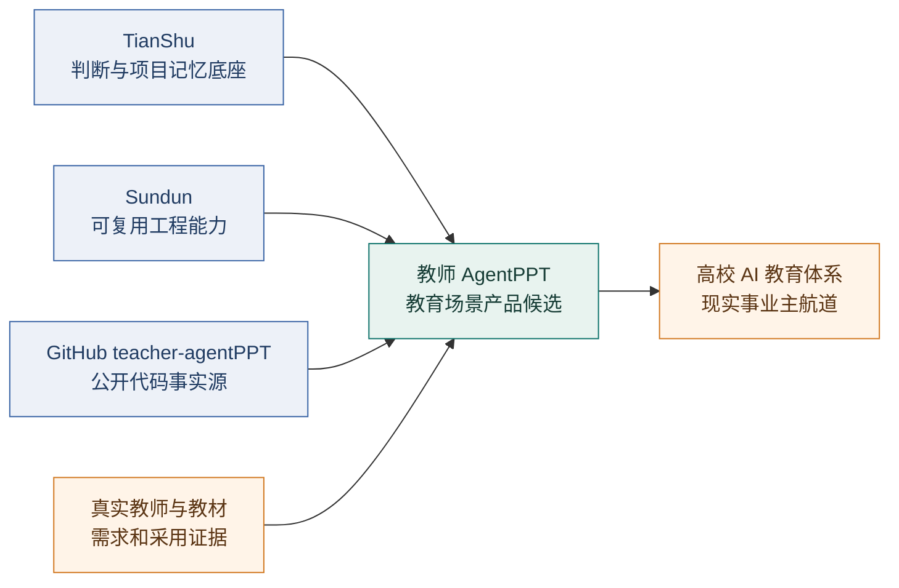
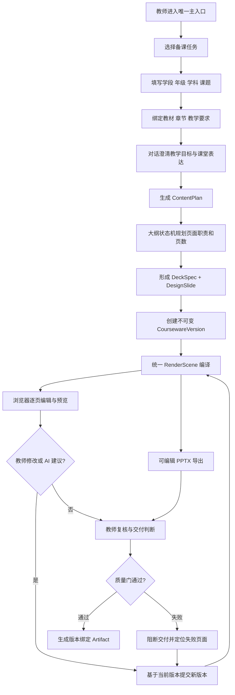
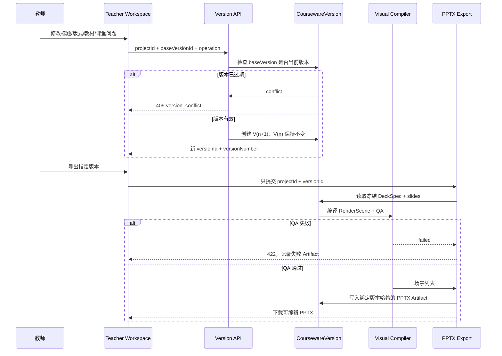
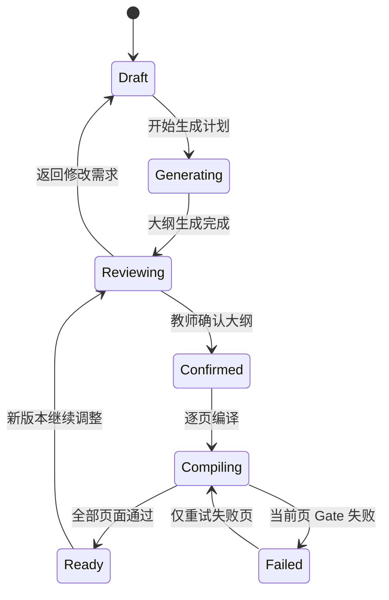
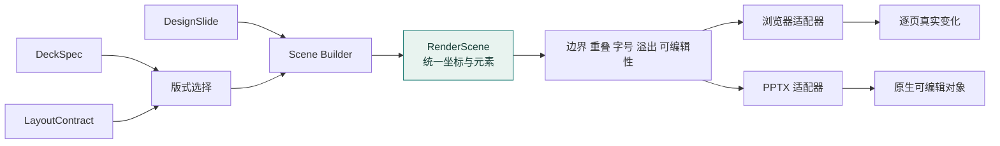
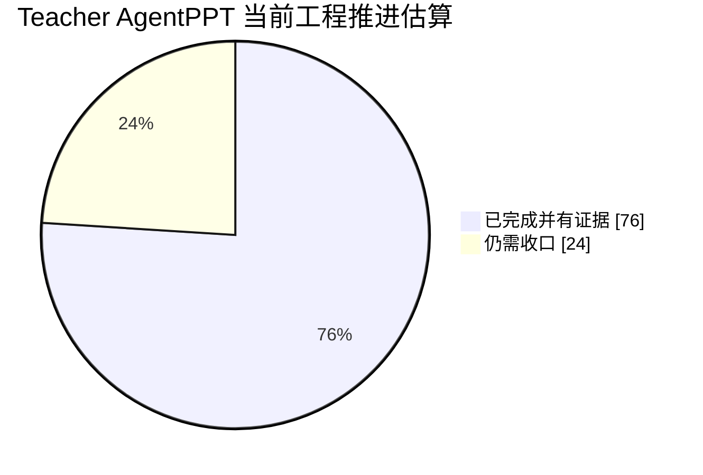
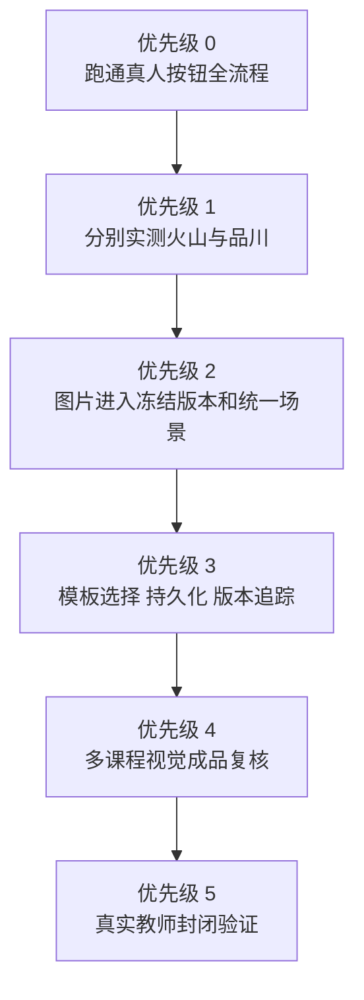

# Teacher AgentPPT｜可视化汇报总览

> [!summary] 一句话结论
> 教师 AgentPPT 已从“固定页面演示”推进到具有真实策划状态机、不可变版本链、统一视觉场景和可编辑 PPTX 导出的产品候选；后端与视觉主干已有自动化证据，但真人按钮全流程、真实图片同源链和模板主入口仍在收口，因此当前状态保持 **PARTIAL / VERIFICATION**，不标记为客户可用。

## 01 / 汇报卡片

| 维度 | 当前结论 | 证据或边界 |
|---|---|---|
| 唯一入口 | `/teacher-ai-ppt` | 旧入口不进入教师主流程 |
| 公开代码仓 | [teacher-agentPPT](https://github.com/liaoj0330-bot/teacher-agentPPT) | `main`，提交 `f6e96df` |
| 冻结版本链 | 已建立并通过真实临时数据库 E2E | 版本读取、409 冲突、教材、对话、导出 Artifact 等 10/10 |
| 页面规划 | 已建立，不固定 9 页 | `TeacherDeckPlan + DeckSpec` 决定页数与页面职责 |
| 视觉编译 | 已建立 | 13 类教师布局、RenderScene、页面 Gate、视觉 QA |
| PPTX 导出 | 已进入统一场景绘制 | 原生文本、形状、表格和图表；不是整页截图 |
| 真人交互 | 部分完成 | 生成前后完整按钮验收仍需最终跑通 |
| 真实出图 | 待完整验收 | 火山/品川需分别验证鉴权、真实图片、超时与降级 |
| 模板能力 | POC 已完成，主入口未闭环 | 模板解析和评分已存在，选择/持久化/版本化待接入 |
| 商业状态 | 尚未成立 | 工程能力不等于真实教师采用和商业交付 |

## 02 / 项目关系图



边界：Sundun 是工程资产，教师 AgentPPT 是产品候选，高校 AI 教育体系是上层事业路径；三者不可混写。

## 03 / 真实用户运行逻辑



关键变化：不是“点击一次生成固定 9 页”，而是先规划页面职责，再按课程内容决定页数，并允许逐页失败、逐页重试。

## 04 / 系统架构与事实来源

```mermaid
flowchart TB
    subgraph UX[教师交互层]
      ENTRY[/teacher-ai-ppt]
      CHAT[备课对话]
      EDITOR[课件编辑器]
    end

    subgraph PLAN[策划与内容层]
      CONTEXT[Teacher Context]
      STATE[TeacherDeckPlan 状态机]
      SPEC[DeckSpec]
      SLIDES[DesignSlide 数组]
    end

    subgraph TRUTH[服务器事实层]
      PROJECT[CoursewareProject]
      VERSION[CoursewareVersion<br/>不可变快照]
      HASH[DeckSpec Hash]
      ARTIFACT[CoursewareArtifact]
    end

    subgraph VISUAL[统一视觉编译层]
      CONTRACT[13 类 LayoutContract]
      SCENE[RenderScene]
      GATE[Page Gate]
      QA[Visual QA]
    end

    subgraph OUTPUT[输出适配层]
      BROWSER[BrowserSceneRenderer]
      PPTX[PptxSceneRenderer]
      TEMPLATE[PPTX Template Parser POC]
      IMAGE[Image Provider<br/>待完整同源验收]
    end

    ENTRY --> CHAT --> CONTEXT --> STATE --> SPEC
    SPEC --> SLIDES --> VERSION
    PROJECT --> VERSION --> HASH
    VERSION --> SCENE
    CONTRACT --> SCENE
    TEMPLATE -.候选布局.-> CONTRACT
    IMAGE -.版本化图片待闭环.-> SCENE
    SCENE --> GATE --> QA
    QA -->|通过或需复核| BROWSER
    QA -->|通过| PPTX --> ARTIFACT
    QA -->|失败| BLOCK[阻断导出]
    EDITOR --> VERSION
```

## 05 / 不可变版本链



## 06 / 规划状态机与单页重试



页面 Gate 的三类动作：

| 状态 | 动作 | 含义 |
|---|---|---|
| `passed` | `continue` | 当前页完成，进入下一页 |
| `review_required` | `review_page` | 页面可用，但需要教师复核 |
| `failed` | `retry_current_page` | 保留已完成页面，只重试当前页的内容、布局或渲染阶段 |

## 07 / 浏览器与 PPTX 同源视觉逻辑



当前真实边界：文本、形状、表格、图表已经进入统一场景；AI 图片仍需完成“供应商响应 → 版本绑定 → RenderScene → 浏览器/PPTX”闭环。

## 08 / 当前进度图

> [!warning] 估算口径
> 下图是工程推进估算，不是客户验收分数，也不代表商业成熟度。



| 层级 | 估算 | 当前判断 |
|---|---:|---|
| 版本事实源与后端链 | 90% | 主链稳定，有 10/10 E2E |
| 策划状态机与页面 Gate | 85% | 已接入，仍需更多真实课程覆盖 |
| 统一视觉编译 | 80% | 浏览器/PPTX 同源主干建立 |
| 可编辑 PPTX 导出 | 80% | 结构验证通过，需更多视觉成品复核 |
| 浏览器真人交互 | 60% | 自动化脚本修复中，完整流程未最终通过 |
| 模板主入口 | 50% | 解析/评分完成，持久化交互待接入 |
| 市场交付成熟度 | 65% | 尚缺真实教师封闭验证和生产运行证据 |

## 09 / 验收证据矩阵

| 验收项 | 状态 | 证据 |
|---|---|---|
| TypeScript | 通过 | 全新安装后 `tsc --noEmit` |
| Production Build | 通过 | Next.js 生产构建；主入口及必要 API 进入路由表 |
| 大纲状态机 | 通过 | 6 页非固定页数回归，失败后单页重试 |
| 13 类教师版式 | 通过 | 概念、例题、练习等页面产生不同槽位结构 |
| 模板解析与评分 | 通过 POC | 读取 master/layout/theme/placeholder，低分明确回退 |
| 版本化交互 | 10/10 | 临时 SQLite、真实 HTTP、不可覆盖版本链 |
| PPTX 可编辑结构 | 通过 | 解包 PPTX，逐页存在独立文本和形状对象 |
| 真人按钮全流程 | 未最终通过 | 脚本已补逐步落盘和场景切页断言，需继续实跑 |
| 火山/品川真实出图 | 未最终通过 | 不能因生成前按钮阻塞而误判供应商失败 |
| 商业交付 | 未成立 | 无真实教师采用与持续生产运行证据 |

## 10 / 下一步优先级



### 汇报时应明确说

1. 已建立真实版本链、策划状态机和可编辑 PPTX 主干。
2. 已经不是固定 9 页的演示逻辑，每页职责与页数由课程策划决定。
3. 浏览器和 PPTX 已开始共用统一视觉场景。
4. 当前仍是产品候选，真人交互、出图同源和模板主入口尚未完成。

### 汇报时不能说

- 不能说已经商业化或可直接面向所有教师交付。
- 不能把 10/10 后端 E2E 写成完整产品 100% 通过。
- 不能把占位图、降级图或供应商未调用写成真实出图成功。
- 不能把 Sundun 工程能力等同于教师 AgentPPT 产品采用成立。

## 11 / 关联入口

- [[30_项目推进区/02_教师AI演示文稿推进台|教师 AI 演示文稿推进台]]
- [[06_项目记忆层/03_智能演示文稿系统/项目记忆首页|Sundun 工程能力现状]]
- [[06_项目记忆层/03_智能演示文稿系统/项目状态卡|项目状态卡]]
- [[06_项目记忆层/03_智能演示文稿系统/P08_教师AI_PPT_069_070_阶段裁定_20260713|069/070 阶段裁定]]
- [[07_资产索引层/03_智能演示文稿系统/03_当前事实来源表|当前事实来源表]]

